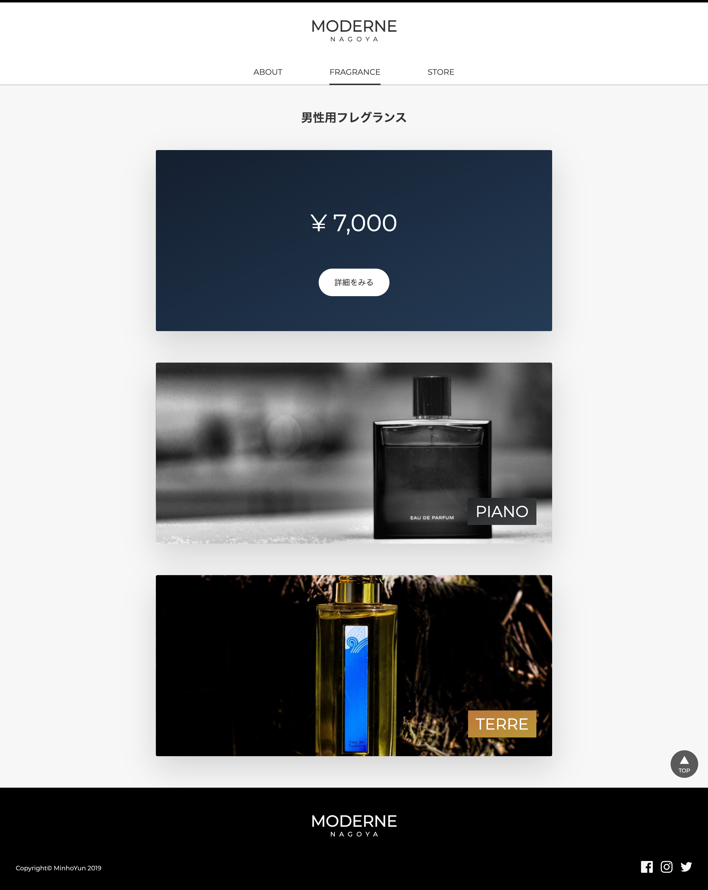
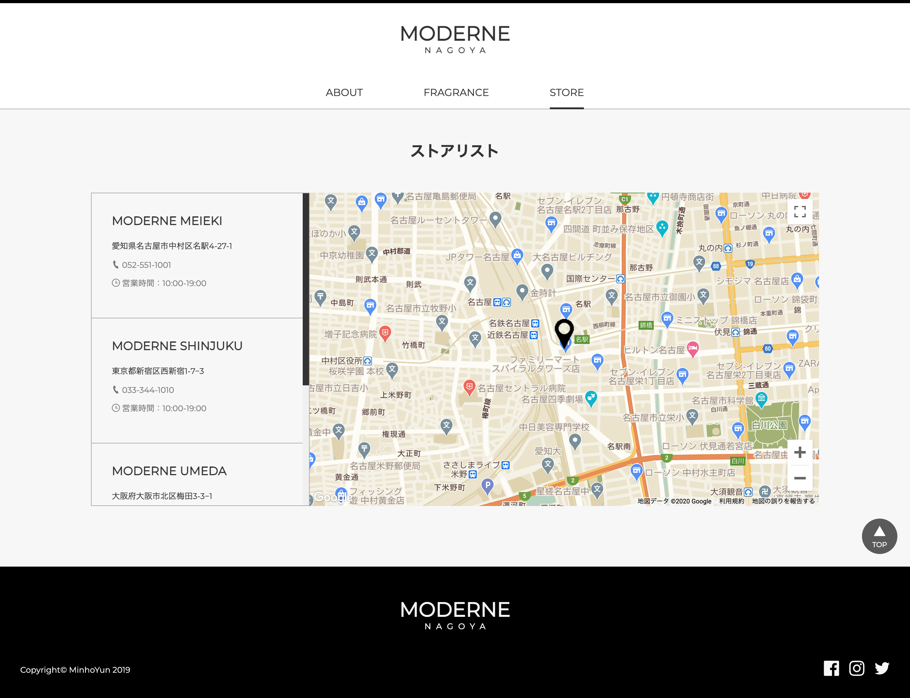

# moderne-css

## 紹介

ウェブデザインの演習のために、香水ブランド MODERNE NAGOYA（仮）のウェブページを作ってみました。 
香水 EC サイトのため、シンプルながら派手なデザインを実装しようとしました。

リンク：https://yun-mh.github.io/moderne-css/

|    |   |
| :--------------------------------------------------------------------: | :--------------------------------------------------------------------: |
|                                 メイン                                 |                                会社紹介                                |
|    |  |
|                               商品リスト                               |                                商品詳細                                |
|  |
|                              ストアリスト                              |

## 構成

- トップ:
  JS のスキッパーをメインビジュアルとして配置し、その下にはグリッド形式でメニュー配置してみました。

- アバウト:
  できるかぎりシンプルに配置しようとし、お店の特長をわかりやすく表現しようとしました。
  一番下には見栄えのハッシュタグのブランドロゴを配置しました。

- 商品一覧:
  商品をカード式で陳列し、マウスオーバーするとフリップされるように作成しました。 
  カードの前面には商品イメージと商品名を、後面には商品価格を表示し、華麗なデザインを具現しようと挑みました。

- 商品詳細:
  商品購入のモーダル・香水ノート構成のためのピラミッドを用意してみました。

- ストアリスト:
  Google Maps API を活用し、支店のリストと実際のマップを連携してみました。

 

## Intro

Web Design for Moderne Nagoya, a perfume boutique, as a practice for CSS. 
Tried to make wep pages simple and fancy because Moderne itself is a perfume boutique.

Link : https://yun-mh.github.io/moderne-css/

## Structures

- Top:
  Put Skipper in Javascript as a main visual, and menus using grid system below it.

- About:
  Put elements as simple as possible, and tried to express features of Moderne concisely.
  On the bottom of the page, there is a brand logo, kind of a hashtag.

- Product list:
  Displayed products as a card type, and can be flipped when cards are hovered.
  Product's image and product's name in the front of each cards, product's price in the back, which makes the page more fancy.

- Product specification:
  Put a modal for purchase and a pyramid for fragrance notes structure.

- Shop list:
  Tried to make connections between a branch in the branch list and map data by using Google Maps API.

 

## 소개

웹디자인 연습용으로 가상의 향수 브랜드 MODERNE NAGOYA의 웹페이지를 만들어봤습니다. 
향수 쇼핑사이트인 만큼, 심플하면서도 화려한 디자인을 구현하고자 했습니다.

링크 : https://yun-mh.github.io/moderne-css/

## 구성

- 탑:
  자바스크립트의 스키퍼를 메인 비쥬얼로 배치하고, 그 아래에는 그리드 형식으로 메뉴를 배치해봤습니다.

- 어바웃:
  가능한 한 심플하게 배치하고자 하였고, 회사의 특징을 알기 쉽게 표현하고자 했습니다.
  맨 아래에는 장식용 해쉬태그식 브랜드 로고를 배치했습니다.

- 상품리스트:
  상품을 카드식으로 진열하여, 마우스오버 시 플립되도록 작성했습니다.
  카드의 전면에는 상품 이미지와 상품명을, 후면에는 상품가격을 표시하여, 화려한 디자인을 구현하고자 시도해봤습니다.

- 상품상세:
  상품 구입의 모달, 향수노트구성 피라미드를 만들어봤습니다.

- 스토어리스트:
  구글 맵스 API를 활용하여 지점 리스트와 실제의 지도를 연계해봤습니다.
